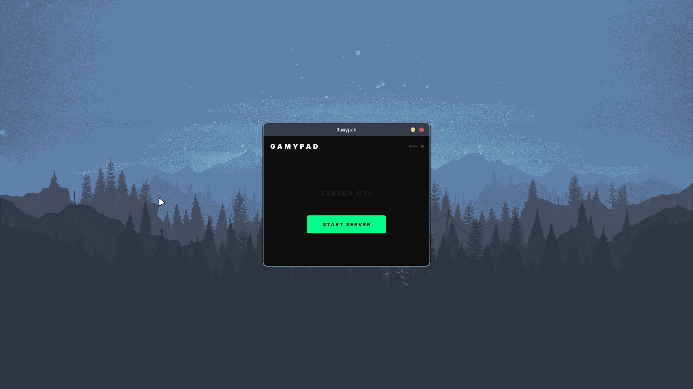
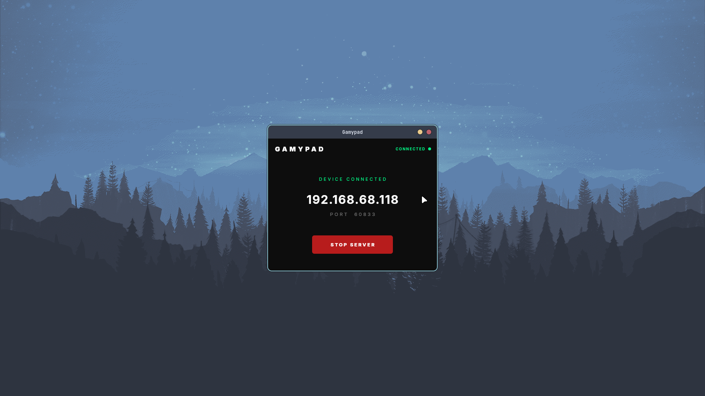
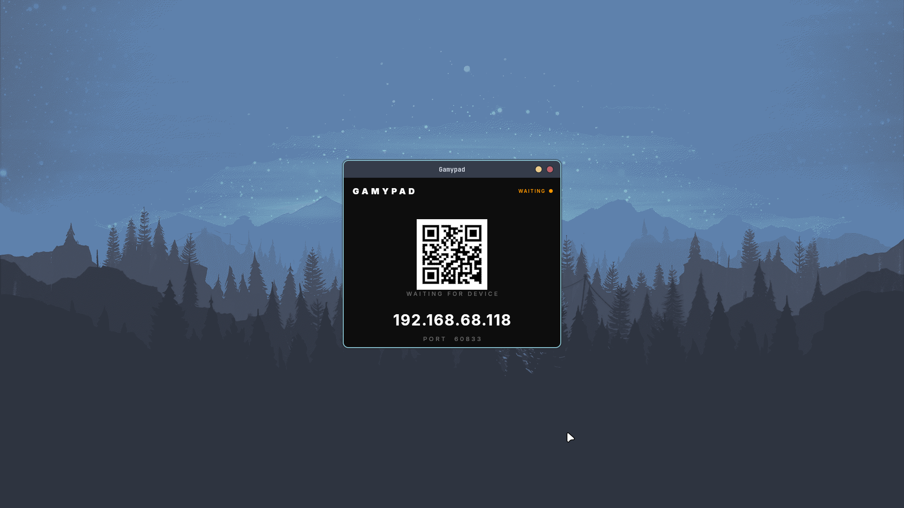
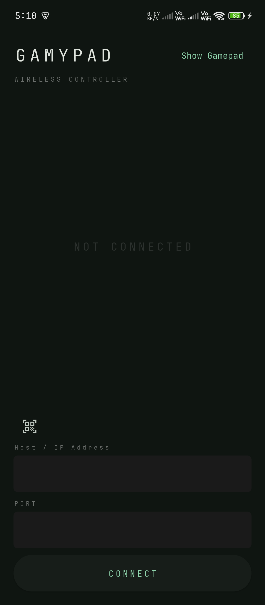
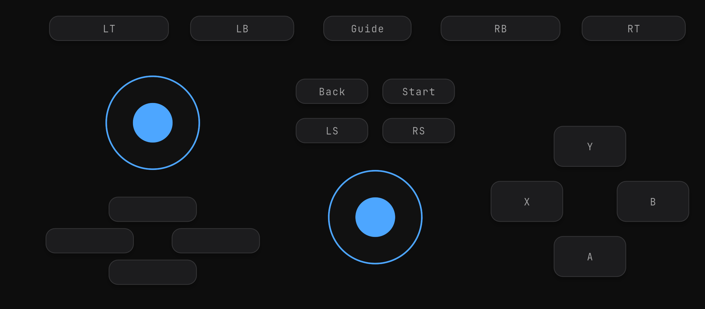

<div align="center">

# 🎮 Gamypad

**Turn your Android phone into a wireless gamepad for Linux.**

Gamypad emulates an Xbox 360 controller via the Linux `uinput` subsystem — no drivers, no configuration. Just scan, connect, and play.

[](https://flutter.dev)
[](https://dart.dev)
[](https://kernel.org)
[](https://developer.android.com)
[](LICENSE)

> 🚀 **Beta** — APK and Linux binary available on the [Releases](https://github.com/abhijeetsagr-g/gamypad/releases) page.

</div>

---

## 📸 Screenshots

### 🖥️ Linux App

| Server Idle | Server Running | QR Code |
|-------------|----------------|---------|
|  |  |  |

### 📱 Android App

| Home | Controller | 
|------|------------|
|  |  |

---

## ⚙️ How It Works

Gamypad has two components:

- **Linux app** — runs a UDP server that receives input from your phone and emulates an Xbox 360 controller via `uinput`
- **Android app** — connects to the server over WiFi and streams button presses, joystick movements, and trigger inputs in real time

Communication is over **UDP** for low-latency input. Both devices must be on the same network — a **phone hotspot** is recommended for the most reliable connection.

---

## ✨ Features

- 🎮 Emulates a full Xbox 360 controller via `uinput`
- 🔘 Full button support — A, B, X, Y, LB, RB, LT, RT, Start, Back, Guide, LS, RS
- 🕹️ Dual joysticks and D-Pad
- 📷 Automatic server detection via QR code scan — auto-fills the connection code
- 🔌 Connection watchdog — detects disconnects on both ends
- 📶 Wireless input via UDP over WiFi

---

## 📋 Requirements

| | Requirement |
|---|---|
| 🖥️ Linux | x86_64, with `uinput` support |
| 📱 Android | 8.0 (API 26)+ |
| 📶 Network | Both devices on the same WiFi (phone hotspot recommended) |

---

## 🚀 Installation

### Linux

1. Download the latest release zip from the [Releases](https://github.com/abhijeetsagr-g/gamypad/releases) page
2. Extract and run the install script:

```bash
unzip Gamypad-x86_64.zip
chmod +x install.sh
./install.sh
```

3. Log out and back in for group permission changes to take effect

### Android

Download and install the APK from the [Releases](https://github.com/abhijeetsagr-g/gamypad/releases) page.

---

## 🎮 Usage

1. Enable hotspot on your Android phone
2. Connect your PC to the phone's hotspot
3. Open **Gamypad** on your PC and click **Start Server**
4. Open the Android app and tap the QR scanner icon
5. Scan the QR code shown on the PC — the connection code fills automatically
6. Tap **Connect** — you're ready to play

---

## 🗑️ Uninstallation

```bash
chmod +x uninstall.sh
./uninstall.sh
```

---

## 🏗️ Building from Source

### Prerequisites

- Flutter SDK 3.x+
- CMake, Clang, GTK3 dev headers

```bash
sudo pacman -S cmake clang gtk3        # Arch
sudo apt install cmake clang libgtk-3-dev  # Ubuntu/Debian
```

### Linux app

```bash
cd gamypad_pc
flutter pub get
flutter build linux --release
```

### Android app

```bash
cd gamypad_apk
flutter pub get
flutter build apk --release
```

---

## 🛠️ Tech Stack

| Layer | Technology |
|-------|------------|
| Framework | Flutter (Dart) |
| Linux Input | `uinput` subsystem |
| Transport | UDP (low-latency) |
| Server Detection | QR code with auto-fill |
| Connection Health | Watchdog timer (both ends) |

---

## 📄 License

MIT

---

<div align="center">

Made with ❤️ and Flutter &nbsp;·&nbsp; [GitHub](https://github.com/abhijeetsagr-g/gamypad)

</div>