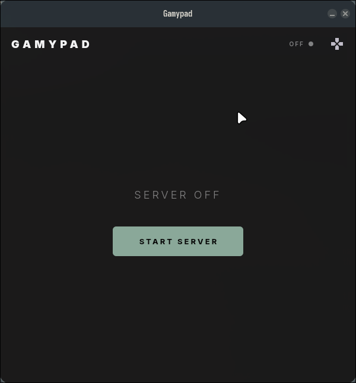
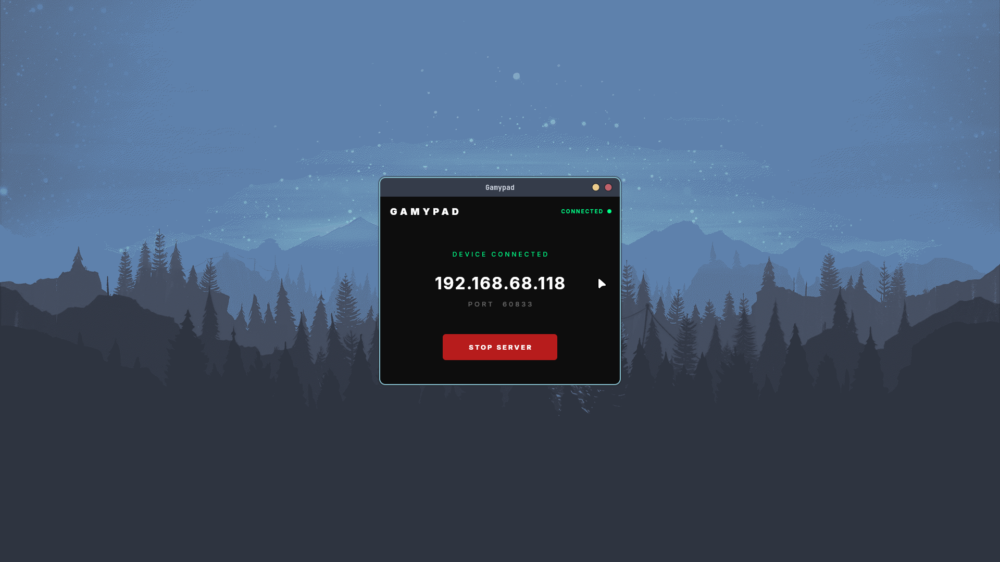
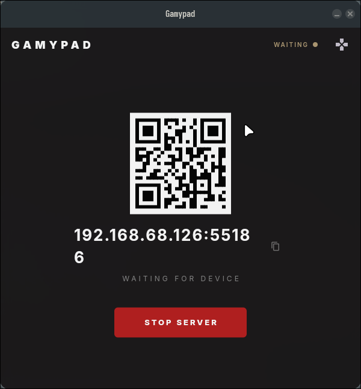
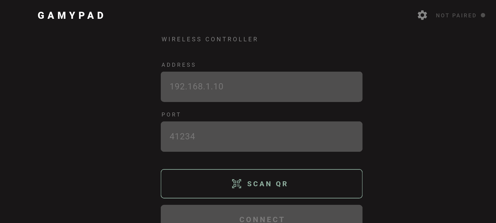
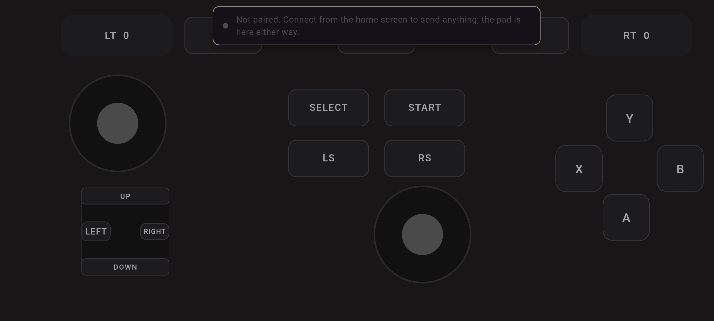

<div align="center">

# 🎮 Gamypad

**Turn your Android phone into a wireless gamepad for Linux.**

Gamypad emulates an Xbox 360 controller via the Linux `uinput` subsystem — no drivers, no configuration. Just scan, connect, and play.

[](https://flutter.dev)
[](https://dart.dev)
[](https://kernel.org)
[](https://developer.android.com)
[](LICENSE)

> 🚀 **Beta** — APK and Linux binary available on the [Releases](../../releases) page.

**Fork:** [`ixiflower/gamypad`](https://github.com/ixiflower/gamypad) · **Upstream:** [`abhijeetsagr-g/gamypad`](https://github.com/abhijeetsagr-g/gamypad)

[English](#-english) · [فارسی](#-فارسی)

</div>

---

## 🌐 English

### 📸 Screenshots

#### 🖥️ Linux App

| Server Idle | Server Running | QR Code |
|-------------|----------------|---------|
|  |  |  |

#### 📱 Android App

| Home | Controller | 
|------|------------|
|  |  |

---

### 🆕 What's New — v1.2.1 BIGBANG

> **Multiplayer + Kick Controls — the biggest update yet.**

This fork builds on upstream `v1.3` and adds true **multiplayer** to the Linux server. No protocol change — your existing APKs keep working.

| Feature | Before | Now |
|---------|--------|-----|
| **Multi-controller** | 1 phone → 1 `uinput` device | **N phones → N `uinput` devices** (`Gamypad 1`, `Gamypad 2`, …) each with its own `playerIndex`, `id.version`, and `uinput` name |
| **Server** | Single `_gamepad` + `onClientStatusChanged(bool)` | `Map<String, ConnectedClient>` keyed by `ip:port`, `ClientInfo(playerIndex, endpoint, lastSeen)`, `onClientsChanged(List<ClientInfo>)` |
| **UI** | `CONNECTED / WAITING / OFF`, one hidden QR while connected | `N CONNECTED / WAITING / OFF`, **QR always visible** (every phone scans the same code), **one card per device** under the count: `🎮 PLAYER 1  192.168.x.x:port  ● LIVE` |
| **Disconnect** | Single 5s watchdog | **Per-device 5s watchdog** — each card drops individually (`📴 Player N disconnected` + `Gamepad.dispose()`) |
| **Kick** | — | **`✕` on every card → "Kick Player N?" confirm dialog** → `MyServer.kickClient(endpoint)` disposes that `Gamepad`/`uinput` device. Kicked phone can reconnect by tapping **Connect** again |
| **Native layer** | `Gamepad()` singleton, `sleep(1)` per device, verbose `setupAbs` | `explicit Gamepad(int playerIndex)`, `usleep(200ms)` per pad, lambda `setupAbs`, safe `keyMap.find()` guard |

**Live behaviour:**
1. Click **START SERVER** → QR `ip:port` stays on screen.
2. Connect phone A → `PLAYER 1` card appears. Connect phone B → `PLAYER 2` card stacks underneath.
3. Tap `✕` → confirm dialog *"Kick Player 1? — 192.168.x.x:port will be disconnected and its virtual gamepad removed…"* → `[ CANCEL ] [ KICK ]` (red). On **KICK** the card slides out, `🦶 Kicked Player 1: ip:port` toast, header updates `2 CONNECTED → 1 CONNECTED → WAITING`.
4. Phone that was kicked sees watchdog-style disconnect; reconnecting creates a new `Player` slot.
5. **STOP SERVER** clears all pads (`_disposeAll` + `UI_DEV_DESTROY`).

**Technical stack (delta):**

| Layer | Detail |
|-------|--------|
| `my_server.dart` | `ConnectedClient{Gamepad, lastSeen}`, `ClientInfo`, `_nextPlayerIndex`, `_keyFor(Datagram)`, ping-gated `Gamepad(_nextPlayerIndex++)` on first contact |
| `Gamepad.h/.cpp` | `Gamepad(int) : player`, `isValid()`, name `Gamypad N`, `snprintf`, `UI_ABS_SETUP` via lambda |
| `GamepadApi.cpp` | `Gamepad_new(int) -> new Gamepad(playerIndex)` with nullptr check |
| `gamepad_*.dart` | FFI `gamepadNew(int)` |
| `home_page.dart` | `_clients: List<ClientInfo>`, cards + `IconButton(close)` → `_confirmKick(c)` → `AlertDialog` |
| `libgamepad.so` | Rebuilt via CMake this time (no more hand-copied blob) |

**Compatibility:** UDP payload unchanged — any installed APK works. Two phones can be hotspot + PC both on hotspot for lowest latency.

---

### ⚙️ How It Works

Gamypad has two components:

- **Linux app** — runs a UDP server that receives input from your phone and emulates one Xbox 360 controller **per phone** via `uinput`
- **Android app** — connects to the server over WiFi and streams button presses, joystick movements, and trigger inputs in real time

Communication is over **UDP** for low-latency input. Both devices must be on the same network — a **phone hotspot** is recommended for the most reliable connection.

---

### ✨ Features

- 🎮 Emulates **N** Xbox 360 controllers via `uinput` (one per phone)
- 🔘 Full button support — A, B, X, Y, LB, RB, LT, RT, Start, Back, Guide, LS, RS
- 🕹️ Dual joysticks and D-Pad per controller
- 📷 Automatic server detection via QR code scan — auto-fills the connection code
- 🔌 Per-device connection watchdog — detects disconnects on both ends (and per-card in UI)
- 👢 Kick per device with confirmation — host controls who stays
- 📶 Wireless input via UDP over WiFi

---

### 📋 Requirements

| | Requirement |
|---|---|
| 🖥️ Linux | x86_64, with `uinput` support |
| 📱 Android | 8.0 (API 26)+ |
| 📶 Network | Both devices on the same WiFi (phone hotspot recommended) |

---

### 🚀 Installation

#### Linux

1. Download `Linux.zip` from the [Releases](../../releases) page (this fork's `v1.2.1-bigbang` or upstream `v1.3`)
2. Extract and run the install script:

```bash
unzip Linux.zip
chmod +x install.sh
./install.sh
```

3. Log out and back in for group permission changes to take effect

#### Android

Download and install `Gamypad.apk` from the [Releases](../../releases) page.

---

### 🎮 Usage

1. Enable hotspot on your Android phone
2. Connect your PC to the phone's hotspot
3. Open **Gamypad** on your PC and click **Start Server**
4. Open the Android app on a phone and tap the QR scanner icon
5. Scan the QR code shown on the PC — the connection code fills automatically
6. Tap **Connect** — `PLAYER 1 ● LIVE` appears on the PC
7. Repeat steps 4–6 on a second phone → `PLAYER 2 ● LIVE` stacks underneath — you're ready for couch co-op
8. To remove a player, tap `✕` on its card → confirm **KICK**

---

### 🗑️ Uninstallation

```bash
chmod +x uninstall.sh
./uninstall.sh
```

---

### 🏗️ Building from Source

#### Prerequisites

- Flutter SDK 3.x+
- CMake, Clang, GTK3 dev headers

```bash
sudo pacman -S cmake clang gtk3        # Arch
sudo apt install cmake clang libgtk-3-dev  # Ubuntu/Debian
```

#### Linux app

```bash
cd gamypad_pc
flutter pub get
flutter build linux --release
# distributable bundle is at build/linux/x64/release/bundle/
# and synced to gamypad_pc/scripts/Gamypad/
```

#### Android app

```bash
cd gamypad_apk_new
flutter pub get
flutter build apk --release
```

---

### 🛠️ Tech Stack

| Layer | Technology |
|-------|------------|
| Framework | Flutter (Dart) |
| Linux Input | `uinput` subsystem — `N × /dev/uinput` devices |
| Transport | UDP (low-latency) |
| Server Detection | QR code with auto-fill |
| Connection Health | Watchdog timer per device (both ends) |
| Native Lib | `libgamepad.so` (CMake + `GamepadApi.cpp` FFI) |

---

### 🙏 Credits & Upstream

Original project by **[@abhijeetsagr-g](https://github.com/abhijeetsagr-g)** — [`abhijeetsagr-g/gamypad`](https://github.com/abhijeetsagr-g/gamypad).

This fork (`ixiflower/gamypad`) adds multiplayer + kick feature. A pull request has been opened upstream to merge it back. If you like the original, please ⭐ the upstream repo!

---

## 🇮🇷 فارسی

### 📸 تصاویر برنامه

#### 🖥️ نسخه‌ی لینوکس

| سرور خاموش | سرور روشن | QR Code |
|-------------|------------|---------|
|  |  |  |

#### 📱 نسخه‌ی اندروید

| خانه | دسته‌ی بازی |
|------|-------------|
|  |  |

---

### 🆕 چه خبر — نسخه‌ی v1.2.1 بیگ‌بنگ

> **چندنفره + کنترل کیک — بزرگ‌ترین به‌روزرسانی تا امروز.**

این فورک بر پایه‌ی نسخه‌ی `v1.3` اصلی ساخته شده و **چندنفره‌ی واقعی** را به سرور لینوکس اضافه می‌کند. پروتکل تغییری نکرده — APKهای نصب‌شده‌ی قبلی بدون نیاز به آپدیت کار می‌کنند.

| قابلیت | قبلاً | حالا |
|---------|--------|------|
| **چند دسته** | ۱ گوشی → ۱ دستگاه `uinput` | **N گوشی → N دستگاه `uinput`** با نام‌های `Gamypad 1`، `Gamypad 2`، … هر کدام با `playerIndex` و `id.version` مجزا |
| **سرور** | یک `_gamepad` و `onClientStatusChanged(bool)` | جدول `Map<String, ConnectedClient>` با کلید `ip:port`، مدل `ClientInfo(playerIndex, endpoint, lastSeen)` و رویداد `onClientsChanged(List<ClientInfo>)` |
| **رابط کاربری** | `CONNECTED / WAITING / OFF` و مخفی شدن QR بعد از اتصال | `N CONNECTED / WAITING / OFF`، **QR همیشه روی صفحه** (همه‌ی گوشی‌ها یک کد را اسکن می‌کنند)، **یک کارت برای هر دستگاه** زیر شمارش: `🎮 PLAYER 1  192.168.x.x:port  ● LIVE` |
| **قطع اتصال** | یک واچ‌داگ ۵ ثانیه‌ای برای همه | **واچ‌داگ ۵ ثانیه‌ای برای هر دستگاه** — هر کارت جداگانه محو می‌شود (`📴 Player N disconnected` + `Gamepad.dispose()`) |
| **کیک (اخراج)** | — | دکمه‌ی **`✕` روی هر کارت → دیالوگ «Kick Player N?»** → متد `MyServer.kickClient(endpoint)` دستگاه `Gamepad`/`uinput` آن گوشی را نابود می‌کند. گوشیِ کیک‌شده با زدن دوباره‌ی **Connect** می‌تواند برگردد |
| **لایه‌ی Native** | `Gamepad()` منفرد، `sleep(1)` برای هر دسته | `explicit Gamepad(int playerIndex)`، `usleep(200ms)`، لامبدا‌ی `setupAbs`، محافظ `keyMap.find()` |

**رفتار زنده:**
۱. روی **START SERVER** بزنید → QR با `ip:port` ثابت می‌ماند.
۲. گوشی A وصل شود → کارت `PLAYER 1` ظاهر می‌شود. گوشی B وصل شود → کارت `PLAYER 2` زیر آن اضافه می‌شود.
۳. روی `✕` بزنید → دیالوگ تأیید *«Kick Player 1? — 192.168.x.x:port … will be disconnected…»* با دو دکمه `[ CANCEL ] [ KICK ]` (قرمز) باز می‌شود. با زدن **KICK** کارت با انیمیشن خارج می‌شود، پیام `🦶 Kicked Player 1: ip:port` نشان داده می‌شود و هدر از `2 CONNECTED` به `1 CONNECTED` و سپس `WAITING` می‌رود.
۴. گوشیِ اخراج‌شده قطع‌شده می‌بیند؛ با اتصال مجدد یک اسلات جدید می‌گیرد.
۵. زدن **STOP SERVER** همه‌ی دسته‌ها را پاک می‌کند (`_disposeAll` + `UI_DEV_DESTROY`).

**تغییرات فنی:**

| لایه | جزئیات |
|------|--------|
| `my_server.dart` | `ConnectedClient{Gamepad, lastSeen}`، `ClientInfo`، `_nextPlayerIndex`، `_keyFor(Datagram)`، ساخت `Gamepad(_nextPlayerIndex++)` فقط در اولین `ping` |
| `Gamepad.h/.cpp` | `Gamepad(int) : player`، `isValid()`، نام `Gamypad N` با `snprintf`، تنظیم `UI_ABS_SETUP` با لامبدا |
| `GamepadApi.cpp` | `Gamepad_new(int) -> new Gamepad(playerIndex)` با بررسی `nullptr` |
| `gamepad_*.dart` | FFI جدید `gamepadNew(int)` |
| `home_page.dart` | `_clients: List<ClientInfo>`، کارت‌ها + `IconButton(close)` → `_confirmKick(c)` → `AlertDialog` تأیید |
| `libgamepad.so` | این بار واقعاً با CMake بیلد شد (نه کپی دستی) |

**سازگاری:** محتوای UDP تغییری نکرده — هر APK نصب‌شده کار می‌کند. برای کمترین تأخیر، هات‌اسپات گوشی را روشن کنید و PC را به همان هات‌اسپات وصل کنید.

---

### ⚙️ نحوه‌ی کار

گم‌ی‌پد دو بخش دارد:

- **برنامه‌ی لینوکس** — یک سرور UDP اجرا می‌کند و برای **هر گوشی یک دسته‌ی Xbox 360** از طریق `uinput` شبیه‌سازی می‌کند
- **برنامه‌ی اندروید** — از طریق WiFi به سرور وصل می‌شود و فشردن دکمه‌ها، حرکت جوی‌استیک‌ها و تریگرها را به‌صورت زنده ارسال می‌کند

ارتباط از طریق **UDP** برای تأخیر کم انجام می‌شود. هر دو دستگاه باید روی یک شبکه باشند — **هات‌اسپات گوشی** مطمئن‌ترین گزینه است.

---

### ✨ ویژگی‌ها

- 🎮 شبیه‌سازی **N** دسته‌ی Xbox 360 از طریق `uinput` (یکی برای هر گوشی)
- 🔘 پشتیبانی کامل از دکمه‌ها — A, B, X, Y, LB, RB, LT, RT, Start, Back, Guide, LS, RS
- 🕹️ دو جوی‌استیک و D-Pad برای هر دسته
- 📷 تشخیص خودکار سرور با اسکن QR — کد اتصال خودکار پر می‌شود
- 🔌 واچ‌داگ برای هر اتصال — قطع‌شدن را در هر دو طرف و روی کارت تشخیص می‌دهد
- 👢 اخراج هر دستگاه با تأیید — میزبان کنترل می‌کند چه کسی بماند
- 📶 ورودی بی‌سیم از طریق UDP روی WiFi

---

### 📋 پیش‌نیازها

| | نیازمندی |
|---|---|
| 🖥️ لینوکس | x86_64 با پشتیبانی `uinput` |
| 📱 اندروید | 8.0 (API 26) به بالا |
| 📶 شبکه | هر دو دستگاه روی یک WiFi (هات‌اسپات گوشی پیشنهاد می‌شود) |

---

### 🚀 نصب

#### لینوکس

۱. فایل `Linux.zip` را از صفحه‌ی [Releases](../../releases) دانلود کنید (نسخه‌ی `v1.2.1-bigbang` این فورک یا `v1.3` اصلی)
۲. آن را باز کنید و اسکریپت نصب را اجرا کنید:

```bash
unzip Linux.zip
chmod +x install.sh
./install.sh
```

۳. برای اعمال تغییر گروه‌ها، یک بار خروج و ورود مجدد انجام دهید.

#### اندروید

فایل `Gamypad.apk` را از صفحه‌ی [Releases](../../releases) دانلود و نصب کنید.

---

### 🎮 روش استفاده

۱. هات‌اسپات گوشی اندرویدی را روشن کنید
۲. PC را به هات‌اسپات گوشی وصل کنید
۳. برنامه‌ی **Gamypad** را روی PC باز کنید و روی **Start Server** بزنید
۴. روی یک گوشی برنامه را باز کنید و روی آیکون اسکن QR بزنید
۵. QR روی PC را اسکن کنید — کد اتصال خودکار پر می‌شود
۶. روی **Connect** بزنید — روی PC کارت `PLAYER 1 ● LIVE` ظاهر می‌شود
۷. مراحل ۴ تا ۶ را روی گوشی دوم تکرار کنید → کارت `PLAYER 2 ● LIVE` زیر آن ظاهر می‌شود — آماده‌ی بازی دونفره!
۸. برای حذف یک بازیکن، روی `✕` کارت او بزنید → تأیید **KICK**

---

### 🗑️ حذف نصب

```bash
chmod +x uninstall.sh
./uninstall.sh
```

---

### 🏗️ بیلد از سورس

#### پیش‌نیازها

- Flutter SDK 3.x+
- CMake, Clang, هدرهای GTK3

```bash
sudo pacman -S cmake clang gtk3        # Arch
sudo apt install cmake clang libgtk-3-dev  # Ubuntu/Debian
```

#### برنامه‌ی لینوکس

```bash
cd gamypad_pc
flutter pub get
flutter build linux --release
# باندل نهایی در build/linux/x64/release/bundle/
# و کپی آن در gamypad_pc/scripts/Gamypad/
```

#### برنامه‌ی اندروید

```bash
cd gamypad_apk_new
flutter pub get
flutter build apk --release
```

---

### 🛠️ تکنولوژی‌ها

| لایه | تکنولوژی |
|-------|------------|
| فریم‌ورک | Flutter (Dart) |
| ورودی لینوکس | زیرسیستم `uinput` — N دستگاه `N × /dev/uinput` |
| انتقال | UDP (تأخیر کم) |
| تشخیص سرور | QR code با پر کردن خودکار |
| سلامت اتصال | تایمر واچ‌داگ برای هر دستگاه (هر دو طرف) |
| کتابخانه‌ی Native | `libgamepad.so` (CMake + FFI `GamepadApi.cpp`) |

---

### 🙏 قدردانی

پروژه‌ی اصلی متعلق به **[@abhijeetsagr-g](https://github.com/abhijeetsagr-g)** — [`abhijeetsagr-g/gamypad`](https://github.com/abhijeetsagr-g/gamypad) است.

این فورک (`ixiflower/gamypad`) قابلیت چندنفره + کیک را اضافه می‌کند و یک pull request برای ادغام به پروژه‌ی اصلی ارسال شده است. اگر از پروژه‌ی اصلی خوشتان آمد، لطفاً به ریپازیتوری اصلی ⭐ بدهید!

---

<div align="center">

Made with ❤️ and Flutter &nbsp;·&nbsp; [GitHub](https://github.com/ixiflower/gamypad) · Fork of [abhijeetsagr-g/gamypad](https://github.com/abhijeetsagr-g/gamypad)

</div>
